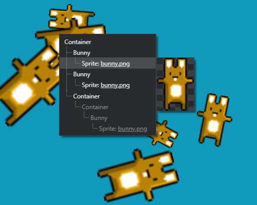
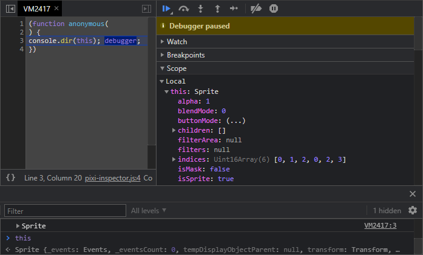

# Pixi Inspector

The tool allowing to browse PixiJS display tree in the context menu and refer objects in the debugger.

## Getting Started

Create PixiJS application and the inspector:

```javascript
import * as PIXI from "pixi.js";
import {PixiInspector} from "pixi-inspector";

const app = new PIXI.Application();
const inspector = new PixiInspector(app.stage, app.renderer);
//... add display objects to your app
```

## Browsing Objects

Right-click on the canvas displays context menu with display object tree under the mouse pointer.



* The context menu does not show the whole display tree, only sprites and meshes under the mouse pointer and their ascendants.
* If no display objects are found under the mouse pointer, the default browser context menu is displayed.
* Menu items for objects on the same level in the tree are sorted by z-index ascending.
* Invisible display objects are greyed out. Objects with `worldVisible == false || worldAplha == 0` are considered invisible.
* Custom classes have the proper name in the menu like `Bunny` in the example. The class name is taken from `constructor.name`.
  > Note: Using the inspector with minified code will result in short uglified object names.
* Hovering the underlined texture name will show a submenu with that texture. Any object with `texture:PIXI.Texture` property has this feature.

## Editing Objects

Clicking on the menu item will log the corresponding object in the console. It also sets a breakpoint in an anonymous function called on that object. The object itself can be accessed in the debugger
as `this` in local scope. Properties of the object can be viewed and changed directly in the debugger or coding in the console.



> Note: The debugger must be opened in advance. There is no way to open the debugger programmatically.

## Configuration

The third argument of `PixiInspector` constructor is the style of the context menu: `light` or `dark`. If no style is specified, it is detected from the browser theme.

The context menu can be disabled and enabled by using the `enabled:boolean` inspector property.

## Live Demo

[Open](https://evgeniy-polyakov.github.io/pixi-inspector/example/index.html)